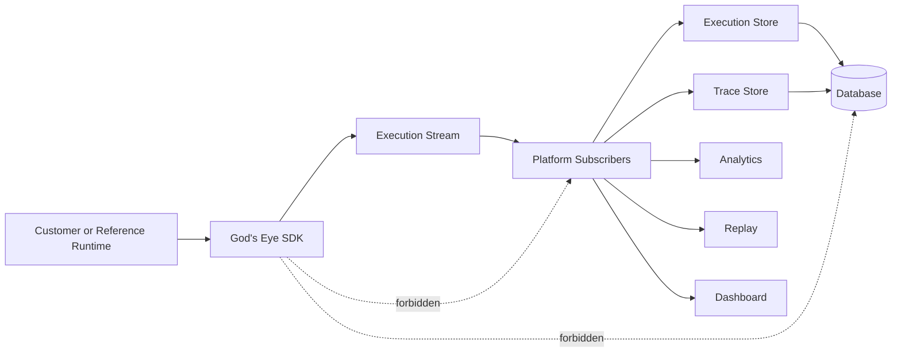

# God’s Eye (AI Observability Platform)

God’s Eye is an execution-stream-driven AI observability system:
- The **SDK** emits immutable telemetry facts (executions, traces, spans).
- The optional **Platform** consumes those facts and decides what to persist/analyze/display.
- The **Dashboard** provides a UI for browsing and inspecting traces and executions.

This repo contains:
- `GodsEye/` (Python SDK + optional Platform backend)
- `GodsEye-Dashboard/` (Next.js dashboard)

## Architecture (high level)

An AI execution is primarily a history of immutable facts (events). The SDK publishes those facts through an `ExecutionStream`; Platform subscribers project them into persisted views (snapshots, traces, analytics, etc.).

### Dependency direction



### Where to read more
- Architecture deep dive: `GodsEye/docs/architecture.md`
- Public SDK API surface: `GodsEye/docs/public-api.md`
- Execution protocol: `GodsEye/protocol/README.md`

## Local setup

### 1) Backend (SDK + Platform)

From the repo root:

```bash
cd GodsEye

# Core SDK (used by customer apps)
uv add gods_eye

# Optional Platform backend dependencies
uv add "gods_eye[platform]"

# Run checks / install dev deps for the reference runtime
uv sync --extra reference --extra dev

# Set up env (reference runtime + demo uses the .env.example)
cp .env.example .env

# Apply demo migrations and start the reference runtime (demo customer app)
uv run alembic upgrade head
uv run uvicorn examples.reference_runtime.main:app --reload
```

Expected endpoints:
- Platform API: `http://localhost:8000`
- Reference runtime (demo customer app) runs via Uvicorn on the same port in this setup.

### 2) Dashboard (Next.js)

From the repo root:

```bash
cd ../GodsEye-Dashboard

cp .env.example .env.local
npm install
npm run dev
```

Open:
- `http://localhost:3000`

Required dashboard env vars (in `.env.local`):
- `NEXT_PUBLIC_GODS_EYE_API_URL` (Platform base URL, e.g. `http://localhost:8000`)
- `NEXT_PUBLIC_SUPABASE_URL`
- `NEXT_PUBLIC_SUPABASE_ANON_KEY`
- Optional: `NEXT_PUBLIC_GITHUB_URL`

### Demo video

Demo video: `<add link>`

## Dashboard repository

If you want the full dashboard-only documentation (routes, sandbox behavior, etc.), see:
- `GodsEye-Dashboard/README.md`

